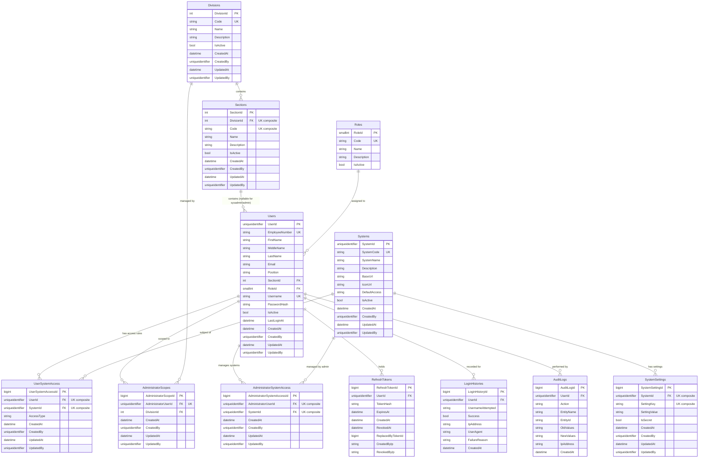

# System Architecture — ERD

> **Section:** System Architecture  
> **Document:** Entity Relationship Diagram  
> **Syntax:** Mermaid ERD  
> **Source of Truth:** [Master Specification](../DO.OneAccess-Specification-v1.md)

---

## Entity Relationship Diagram

---

## Cardinality Summary

| Relationship | Cardinality | Notes |
|---|---|---|
| Division → Section | 1 : N | A Division has many Sections |
| Section → User | 1 : N | A Section contains Users (nullable for SysAdmin/Admin) |
| Role → User | 1 : N | Each User has exactly one Role |
| User → UserSystemAccess | 1 : N | A User may have multiple access overrides |
| System → UserSystemAccess | 1 : N | A System may have many user overrides |
| System → SystemSettings | 1 : N | A System has multiple setting keys |
| User → AdministratorScope | 1 : 0..1 | Administrators have at most one scope |
| Division → AdministratorScope | 1 : N | A Division may be the scope of multiple Admins |
| User → AdministratorSystemAccess | 1 : N | An Administrator may be granted management rights over multiple systems |
| System → AdministratorSystemAccess | 1 : N | A System may be granted to multiple Administrators |
| User → RefreshTokens | 1 : N | A User may have multiple refresh tokens (rotation/multi-device) |
| User → LoginHistories | 1 : N | Many login events per user (UserId nullable for unresolved attempts) |
| User → AuditLogs | 1 : N | Audit log entries (UserId nullable for system events) |

---

## Key Constraints

| Constraint | Entity | Field(s) | Notes |
|---|---|---|---|
| Unique | `Roles` | `Code` | Programmatic role code |
| Unique | `Divisions` | `Code` | Unique division code |
| Unique | `Sections` | `(DivisionId, Code)` | Unique within Division |
| Unique | `Users` | `EmployeeNumber` | Official employee business identifier |
| Unique | `Users` | `Username` | Login identifier |
| Unique | `Systems` | `SystemCode` | Canonical system code |
| Unique | `SystemSettings` | `(SystemId, SettingKey)` | Unique setting key per system |
| Unique | `UserSystemAccess` | `(UserId, SystemId)` | One rule per user per system |
| Unique | `AdministratorScopes` | `AdministratorUserId` | One division scope per Administrator |
| Unique | `AdministratorSystemAccess` | `(AdministratorUserId, SystemId)` | One management grant per admin per system |

---

## Access Concept Separation

> `UserSystemAccess` — controls whether a **User can use** a System (`AccessType`: `Allow` / `Deny`).  
> `AdministratorSystemAccess` — controls which **Systems an Administrator can manage**. Separate from `UserSystemAccess`.  
> `AdministratorScopes` — controls which **Division an Administrator can manage**.  
> These are distinct concepts and must not be conflated.

---

## Notes

- **Identifier Strategy:**
  - `uniqueidentifier` / GUID: Externally meaningful and integration-facing identities (`UserId`, `SystemId`). `UserId` is the single stable technical identity.
  - `smallint` / `int`: Internal reference entities (`RoleId`, `DivisionId`, `SectionId`).
  - `bigint`: High-volume transactional, history, and access records (`AdministratorScopeId`, `AdministratorSystemAccessId`, `UserSystemAccessId`, `RefreshTokenId`, `LoginHistoryId`, `AuditLogId`, `SystemSettingId`).
- **Primary Key Naming:** Explicit entity-specific `<Entity>Id` naming is canonical; generic `Id` is not used.
- `AuditLogs` must never contain passwords, tokens, or secrets. `UserId` is nullable for system/background events.
- `RefreshTokens.TokenHash` stores a cryptographic hash, never plaintext. Revocation tracked via `RevokedAt` timestamp and `ReplacedByTokenId`.
- `AdministratorSystemAccess.AdministratorUserId` references an Administrator User. System Administrator does not require an entry (global authority).
- `docs/DO.OneAccess-Specification-v1.md` is the canonical source of truth for architecture and database definitions.
